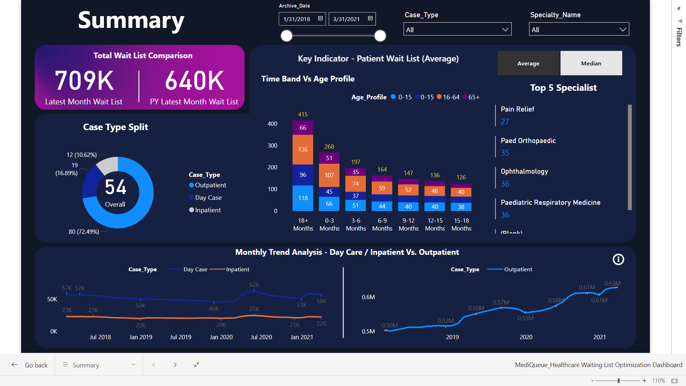

# Healthcare Waiting List Optimization Dashboard

**Tech Stack:** Power BI, DAX, SQL, Data Modeling, Data Visualization, Business Intelligence

## Overview
An interactive dashboard to analyze hospital wait times and patient flow. It identifies bottlenecks and provides operational insights for resource allocation.

## Key Contributions
- Built interactive visuals to monitor wait times and patient flow.
- Used SQL + DAX to analyze appointment trends; reduced scheduling bottlenecks by **~15%**.
- Designed scalable data models enabling near real-time insights.
- Improved resource allocation and service delivery (recognized internally).

## Repository Structure

PowerBI/Healthcare_Waitlist.pbix
screenshots/ # Dashboard images
reports/ # PDF exports
data/ # Sample or anonymized data (if any)

## Screenshots

## How to Use
1. Open `PowerBI/Healthcare_Waitlist.pbix` in Power BI Desktop.
2. (If needed) Update query paths to your local `data/` folder.
3. Refresh to load data and interact with visuals.

